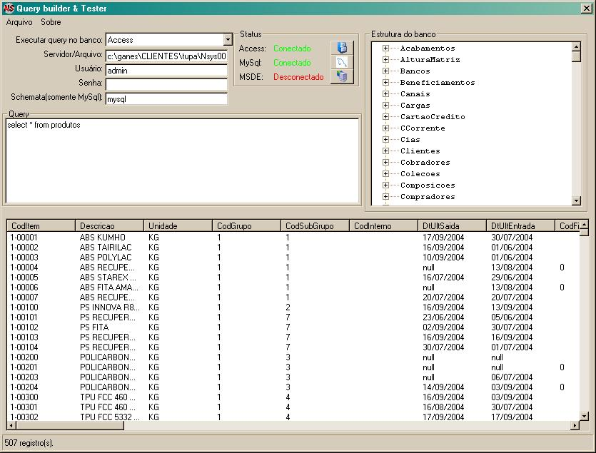



## SQL Buddy 2\.0

### Description

Well, I've submited this guy few days ago, but it was not translated. Now I did more than a simple translation, I've made a multi-lenguage system, that I believe you will like. Don't forget to vote if you like it.
 
### More Info
 

             |
---                |---
**Submitted On**   |2005-03-07 15:55:28
**By**             |[kerplunk\_boy](https://github.com/Planet-Source-Code/PSCIndex/blob/master/ByAuthor/kerplunk-boy.md)
**Level**          |Intermediate
**User Rating**    |4.8 (19 globes from 4 users)
**Compatibility**  |VB 3\.0, VB 4\.0 \(16\-bit\), VB 4\.0 \(32\-bit\), VB 5\.0, VB 6\.0
**Category**       |[Data Structures](https://github.com/Planet-Source-Code/PSCIndex/blob/master/ByCategory/data-structures__1-33.md)
**World**          |[Visual Basic](https://github.com/Planet-Source-Code/PSCIndex/blob/master/ByWorld/visual-basic.md)
**Archive File**   |[SQL\_Buddy\_1864653152005\.zip](https://github.com/Planet-Source-Code/kerplunk-boy-sql-buddy-2-0__1-59483/archive/master.zip)

